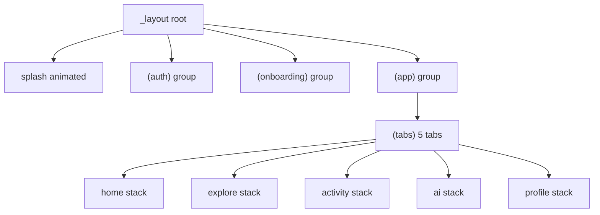

# Premium Dark iOS-Style Mobile App — System Spec

## Purpose
This document is the single source of truth for the mobile app’s strict, premium dark UX/UI system, including navigation rules, component architecture, animation system, state/data conventions, UX behaviors, and production readiness.

## Non-Negotiables
- Dark mode only (no light theme toggle).
- Reject generic/material/template UI.
- Soft separation (glow/blur/gradients) instead of hard borders.
- Single primary accent per screen (semantic + token-driven).
- Motion must be subtle and fast: 180–320ms (hard cap 400ms).

## Version
- `0.1`

## Sections (implemented in order)
1. Principles
2. Design tokens (Tamagui)
3. Layout rules
4. Navigation model (expo-router)
5. Screen inventory
6. Component architecture & contracts
7. Animation system
8. State & data
9. UX behaviors
10. Observability & CI / DevOps
11. Migration IA (legacy Control Center)

> Populate each section as you progress through the execution tasks.

## 1. Principles

### Dark-only, premium by default
- The product uses **dark mode only**. There is no light theme toggle and no “system theme” variability at runtime.
- The UI must feel **iOS-style luxury**: deliberate spacing, soft depth, controlled motion, and no generic/material/template styling.

### Soft separation (no hard borders)
- Prefer **gradients, glow, blur, and elevation** over `borderWidth`/hard hairlines.
- When separation is required, use layered backgrounds and translucency rather than hard outlines.

### Large radius everywhere
- Use **large radii** for all touch targets and surfaces: cards, pills, sheets, and panels.
- Avoid “sharp UI” even on small elements (labels, chips, list rows).

### High-contrast typography
- Text must remain high-contrast against background layers at every hierarchy level (title, body, labels, helper text).
- Maintain consistent label/value hierarchy; do not rely on low-contrast muted text to communicate state.

### Single accent color per screen
- Each screen must use **one primary accent color** to anchor the visual identity.
- Accent usage is token-driven and route-aware:
  - Token naming rule: screens set a `screenAccent` group (or equivalent token mapping) based on their route group.
  - Avoid per-component “random accents.” Components consume the screen-level accent tokens.

### Max viewport usage + strict spacing discipline
- Use **edge-to-edge** layouts (within Safe Area constraints) and maximize usable viewport height.
- Prefer collapsible headers and minimal top spacing rather than fixed vertical padding stacks.
- Avoid centered “web column” layouts; content is anchored to top/leading with a consistent horizontal inset.

### Navigation must stay minimal
- No hamburger menus.
- Back navigation should remain visible within stack-based flows (tabs are for top-level navigation only).

## 2. Design tokens (Tamagui)

All UI primitives must consume the same token set so the system cannot “drift” into generic styling.

### Colors
- Background layers (surface depth):
  - `bg0`: deepest background
  - `bg1`: elevated background layer (beneath cards)
  - `bg2`: card/surface background layer
- Text colors:
  - `textPrimary`: main headings + important values
  - `textSecondary`: supporting copy
  - `textMuted`: helper text and secondary metadata
- Semantic colors:
  - `danger`: errors and destructive actions
  - `success`: success states
- Accent (screen-level only):
  - Each screen defines exactly one accent group via `screenAccent`.
  - Components may use `accentPrimary`, `accentSoft`, etc., but only sourced from the current screen’s accent group.
  - Do not allow components to pick their own accent colors ad-hoc.

### Radius (large everywhere)
- Use large radii for touch surfaces:
  - Cards, chips, inputs, and buttons must use the shared “large radius” scale.
- Sheets and panels must be the same radius family but with larger radii than typical cards.

### Spacing (strict scale)
- The spacing system is locked:
  - base = `8`
  - common gaps = `16`
  - section padding = `24`
- Forbidden: arbitrary magic numbers for layout gaps and paddings.

### Typography (Inter only)
- Font family: `Inter` only.
- Allowed weights:
  - headings: `600–700`
  - body: `400–500`
  - labels: `500`
- Max two font sizes per section:
  - Each screen section may use at most two sizes (for example: title + body, or label + value).

### Accent rules (token-driven)
- Every route group must map to an accent group (e.g., `(app)/(tabs)` home uses `screenAccent=home`, explore uses `screenAccent=explore`, etc.).
- When a component is rendered in a screen context, it reads accent tokens from the screen’s mapping—components do not manage accent selection.

## 3. Layout rules

### Edge-to-edge by default
- Screens must maximize usable space with **edge-to-edge** presentation.
- Use Safe Area insets only where required (camera notch, system gestures, keyboard) and avoid double-padding.

### Consistent horizontal inset
- Apply one consistent leading/trailing inset across screens (derived from the spacing scale; commonly `16`).
- Avoid per-screen ad-hoc padding that changes visual rhythm.

### Scroll and max viewport usage
- Prefer scrolling containers sized to content with flexible space rather than fixed-height layouts.
- For feed/list screens, scroll behavior must preserve the visual chrome (gradient background, headers) without re-centering content.

### Collapsible headers instead of top-heavy padding
- Large titles and primary context should live in collapsible headers.
- Reduce static top spacing: when content scrolls, header height can shrink smoothly instead of leaving unused blank space.

### No centered “web” layouts
- Do not implement centered column constraints typical of web dashboards.
- Content is anchored to top/leading with a measured inset and uses full available width.

## 4. Navigation model (expo-router)

### Route groups (file-tree contract)
- The app root uses expo-router groups to enforce UX boundaries and avoid “template” navigation patterns.
- Required top-level groups:
  - `(auth)` for the authentication flow
  - `(onboarding)` for the 3-step onboarding flow
  - `(app)` for the authenticated experience
    - `(app)/(tabs)` contains the top-level tabs

### Exactly five tabs
- `(app)/(tabs)` must expose **exactly five** tabs:
  - `home`
  - `explore`
  - `activity`
  - `ai`
  - `profile`
- There is **no hamburger menu**.
- Each tab is a **stack**: the user can push detail screens and back navigation remains visible.

### Back navigation behavior
- Back navigation should remain visible inside stack-based flows.
- Avoid patterns that replace back with custom “open drawer” interactions.

### Auth routes
- `(auth)` must include:
  - `welcome`
  - `sign-in`
  - `sign-up`
  - `forgot-password`
  - `otp-verify`

### Onboarding behavior
- `(onboarding)` is a **three full-screen step** flow.
- Users can swipe between steps.
- There is a **Skip** control at the top-right.
- A bottom **primary CTA** advances the flow.

## 5. Screen inventory

This inventory is the required coverage list for implementation and QA.

### Accent group mapping (screenAccent)
- `(app)/(tabs)/home` uses `screenAccent = home`
- `(app)/(tabs)/explore` uses `screenAccent = explore`
- `(app)/(tabs)/activity` uses `screenAccent = activity`
- `(app)/(tabs)/ai` uses `screenAccent = ai`
- `(app)/(tabs)/profile` uses `screenAccent = profile`

### Home tab stack
- Purpose: primary control center overview.
- Root route: `home`
- Stack children:
  - `detail` (placeholder for a selected item)

### Explore tab stack
- Purpose: search and discovery.
- Root route: `explore`
- Stack children:
  - `search` (if separated from root)
  - `detail`

### Activity tab stack
- Purpose: saved/activity feed.
- Root route: `activity`
- Stack children:
  - `detail` (placeholder)

### AI tab stack
- Purpose: AI interaction (voice orb experience).
- Root route: `ai`
- Stack children:
  - `voice` (voice orb screen / placeholder)

### Profile tab stack
- Purpose: user profile and settings.
- Root route: `profile`
- Stack children:
  - `settings`

## 6. Component architecture & contracts

This section is the implementation contract for the component library. Every component must:
- Follow the section’s layout + token rules (consume tokens, do not invent new styles).
- Provide accessibility labels for every interactive element.
- Use the screen-level accent tokens only through the current screen context (do not pick accents locally).

### Layout components

#### `AppScreen`
- Responsibility: Standard screen shell (background + safe-area + optional scroll).
- Props contract (minimum):
  - `children: React.ReactNode`
  - `scrollable?: boolean` (default: true)
  - `testID?: string`
- Accessibility:
  - Container is not interactive; ensure children receive their own labels.
- Token usage:
  - Uses `bg0/bg1` surfaces.
  - Applies consistent horizontal inset (via layout rules).

#### `GradientBackground`
- Responsibility: Background gradients + soft glow layers (no hard borders).
- Props contract:
  - `children?: React.ReactNode` (optional)
  - `testID?: string`
- Accessibility: not interactive.
- Token usage:
  - Uses `bg0/bg1/bg2` and the current screen `screenAccent` to tint glow layers.

#### `SafeAreaLayout`
- Responsibility: Apply safe-area insets only once.
- Props contract:
  - `children: React.ReactNode`
  - `edges?: "top" | "bottom" | "left" | "right"[]` (or equivalent)
  - `testID?: string`
- Accessibility: not interactive.
- Token usage: no direct styling; ensures layout padding discipline.

### UI components

#### `GlassCard`
- Responsibility: Soft, elevated “glass” surface for content.
- Props contract:
  - `children: React.ReactNode`
  - `onPress?: () => void` (if pressable)
  - `variant?: "default" | "compact"` (implementation-defined; must map to tokens)
  - `testID?: string`
- Accessibility:
  - If pressable: `accessibilityRole="button"` + `accessibilityLabel`.
  - Disabled state must expose `accessibilityState={{ disabled: true }}`.
- Token usage:
  - Uses `bg2` plus translucency/glow tinted by `screenAccent`.
  - Text uses `textPrimary/textSecondary`.

#### `Section`
- Responsibility: A vertical content group with consistent spacing.
- Props contract:
  - `title?: string`
  - `children: React.ReactNode`
  - `testID?: string`
- Accessibility:
  - Title should be rendered as an accessible heading.
  - No new interactive elements by default.
- Token usage:
  - Spacing uses section padding (`24`) and the global gap scale.

#### `CollapsibleSection`
- Responsibility: Toggleable content with smooth height animation.
- Props contract:
  - `title: string`
  - `children: React.ReactNode`
  - `defaultOpen?: boolean`
  - `testID?: string`
- Accessibility:
  - Toggle control uses `accessibilityRole="button"` and `accessibilityLabel` = title.
  - Expose open/closed state (e.g., `accessibilityState={{ expanded: true/false }}`).
- Token usage:
  - Uses `textPrimary/textSecondary` and accent tint for affordance.
  - No hard borders; use translucent separators.

#### `BottomSheet`
- Responsibility: Modal bottom sheet with snap behavior.
- Implementation: use `@gorhom/bottom-sheet`.
- Props contract:
  - `open: boolean`
  - `onOpenChange?: (open: boolean) => void`
  - `children: React.ReactNode`
  - `testID?: string`
- Accessibility:
  - When open, sheet has an accessible label.
  - Provide `accessibilityRole="dialog"`.
- Token usage:
  - Uses panel surface tokens (card/sheet radius, `bg2/bg1`).
  - Accent tint applies only to glow/active elements.

#### `SlidePanel`
- Responsibility: Slide-in overlay panel (drawer-style, but no hamburger semantics).
- Props contract:
  - `open: boolean`
  - `onOpenChange?: (open: boolean) => void`
  - `children: React.ReactNode`
  - `testID?: string`
- Accessibility:
  - When open: role `dialog` + accessible label.
- Token usage:
  - Same surface + radius rules as sheets/panels.

### Input components

#### `TextField`
- Responsibility: Labeled text input with inline error support.
- Props contract:
  - `label?: string`
  - `placeholder?: string`
  - `value: string`
  - `onChangeText: (next: string) => void`
  - `secureTextEntry?: boolean`
  - `error?: string`
  - `testID?: string`
- Accessibility:
  - Input has `accessibilityLabel` derived from `label` or placeholder.
  - When `error` exists, expose it via `accessibilityHint` or `accessibilityLiveRegion`.
- Token usage:
  - Background uses `bg2`.
  - Error text uses `danger`.

#### `SearchField`
- Responsibility: Search input with icon affordance and keyboard-safe behavior.
- Props contract:
  - Same as `TextField` plus:
  - `onSubmitEditing?: () => void`
  - `testID?: string`
- Accessibility:
  - `accessibilityLabel="Search"`, or derive from `label`.
- Token usage:
  - Same tokens as `TextField`; accent tint limited to focus state.

#### `OTPField`
- Responsibility: Multi-digit OTP entry.
- Props contract:
  - `length: number` (e.g., 6)
  - `value: string` (or `string[]`)
  - `onChange: (next: string) => void`
  - `error?: string`
  - `testID?: string`
- Accessibility:
  - Each digit cell must be reachable; `accessibilityLabel` includes digit position.
  - Error exposure via accessible hint.
- Token usage:
  - Uses `danger` for invalid; accent tint for active focus.

#### `SelectSheet`
- Responsibility: Tap-to-select bottom sheet.
- Props contract:
  - `open: boolean`
  - `onOpenChange?: (open: boolean) => void`
  - `options: Array<{ label: string; value: string }>`
  - `value: string`
  - `onValueChange: (next: string) => void`
  - `testID?: string`
- Accessibility:
  - Selected item announced; sheet has dialog role.
- Token usage:
  - Uses accent tint for selected option; surfaces use `bg2`.

### Action components

#### `PrimaryButton`
- Responsibility: Main CTA with subtle press animation.
- Props contract:
  - `label: string`
  - `onPress: () => void`
  - `disabled?: boolean`
  - `testID?: string`
- Accessibility:
  - Role `button` + label.
  - Disabled sets accessibility state.
- Token usage:
  - Background uses accent primary tokens derived from screen `screenAccent`.
  - Text uses high-contrast text token.

#### `SecondaryButton`
- Responsibility: Secondary action styling.
- Props contract:
  - `label: string`
  - `onPress: () => void`
  - `disabled?: boolean`
  - `testID?: string`
- Accessibility:
  - Role `button` + label.
- Token usage:
  - Uses surfaces + accent soft tint.

#### `IconButton`
- Responsibility: Icon-only press control.
- Props contract:
  - `icon: React.ReactNode`
  - `accessibilityLabel: string`
  - `onPress: () => void`
  - `disabled?: boolean`
  - `testID?: string`
- Accessibility:
  - Mandatory `accessibilityLabel`.
- Token usage:
  - Uses glass/button surface tokens; accent only for active/pressed states.

#### `FAB`
- Responsibility: Floating action button for contextual primary action.
- Props contract:
  - `icon: React.ReactNode`
  - `accessibilityLabel: string`
  - `onPress: () => void`
  - `disabled?: boolean`
  - `testID?: string`
- Accessibility:
  - Role `button` + accessibilityLabel.
- Token usage:
  - Accent primary background; radius and glow follow system.

### Content components

#### `FeatureCard`
- Responsibility: Display a feature with headline + description.
- Props contract:
  - `title: string`
  - `description?: string`
  - `icon?: React.ReactNode`
  - `onPress?: () => void`
  - `testID?: string`
- Accessibility:
  - If pressable: accessibilityLabel includes title.
- Token usage:
  - Card surface uses `bg2` + accent glow.

#### `StatCard`
- Responsibility: Labeled metric display.
- Props contract:
  - `label: string`
  - `value: string`
  - `testID?: string`
- Accessibility:
  - Compose “label, value” in accessibility.
- Token usage:
  - `textPrimary` for value, `textSecondary` for label.

#### `ListRow`
- Responsibility: Row in lists with optional right affordance.
- Props contract:
  - `title: string`
  - `subtitle?: string`
  - `onPress?: () => void`
  - `rightSlot?: React.ReactNode`
  - `testID?: string`
- Accessibility:
  - If pressable: role button + label = title.
- Token usage:
  - Uses glass/list row surface tokens; no hard borders.

#### `MediaCard`
- Responsibility: Content card that can include media/thumbnail.
- Props contract:
  - `title?: string`
  - `media?: { uri: string }`
  - `children?: React.ReactNode`
  - `testID?: string`
- Accessibility:
  - Provide accessible label for media if title missing.
- Token usage:
  - Uses `bg2` and panel radius family.

### Navigation components

#### `BottomTabBar`
- Responsibility: Custom tab bar UI (no hamburger).
- Props contract:
  - `tabs: Array<{ key: string; label: string; icon: React.ReactNode }>`
  - `activeKey: string`
  - `onTabPress: (key: string) => void`
  - `testID?: string`
- Accessibility:
  - Active tab announced; each tab is role `button` with label.
- Token usage:
  - Accent tint driven by active tab + screen `screenAccent`.

#### `Header`
- Responsibility: Standard header row.
- Props contract:
  - `title: string`
  - `leftSlot?: React.ReactNode`
  - `rightSlot?: React.ReactNode`
  - `testID?: string`
- Accessibility:
  - Title rendered as heading.
- Token usage:
  - Uses background translucency; no hard borders.

#### `LargeTitleHeader`
- Responsibility: Collapsible large header (used with scroll).
- Props contract:
  - `title: string`
  - `subtitle?: string`
  - `children?: React.ReactNode`
  - `testID?: string`
- Accessibility:
  - Title and subtitle as headings/text.
- Token usage:
  - Uses accent glow tinted by `screenAccent`.

### State components

#### `SkeletonLoader`
- Responsibility: Skeleton content placeholders (no spinners).
- Props contract:
  - `lines?: number`
  - `height?: number`
  - `width?: number | "full"`
  - `testID?: string`
- Accessibility:
  - Optionally hide from screen readers if purely decorative.
- Token usage:
  - Uses muted text color with animated shimmer (subtle).

#### `EmptyState`
- Responsibility: Dedicated empty screen/table state with one primary action.
- Props contract:
  - `title: string`
  - `description?: string`
  - `primaryAction?: { label: string; onPress: () => void }`
  - `testID?: string`
- Accessibility:
  - Action button has label; text is readable.
- Token usage:
  - Uses `textPrimary/textSecondary`, and accent only on action.

#### `LoadingState`
- Responsibility: Full-screen loading for rare blocking operations.
- Props contract:
  - `title?: string`
  - `description?: string`
  - `testID?: string`
- Accessibility:
  - Should expose “Loading” text.
- Token usage:
  - Must remain skeleton-first; avoid spinners for content lists.

## 7. Animation system

### Timing constraints (non-negotiable)
- Animation durations must be **180–320ms**.
- The hard cap is **400ms**.
- Avoid long-running or continuous animations on standard screens unless explicitly part of a premium “idle” effect (e.g., voice orb).

### Spring usage rules
- Use **spring** only for key interactions:
  - button press feedback
  - sheet/panel snap affordances
  - “confirm” moments where responsiveness matters
- Do not apply spring to every state change; avoid bouncy/overshoot-heavy feel.

### Allowed motion primitives
- `fade`: cross-fade between states/screens.
- `slide`: subtle vertical/horizontal movement (no fast lateral sweeps).
- `scale`: press-only (scale down/up on touch down/up).
- `spring`: key interactions only (as above).
- `collapsible height`: smooth height/opacity changes for expandable sections.

### Tab and stack transitions
- Tab transitions must be subtle: prefer cross-fade or minimal slide.
- Stack transitions must preserve context (avoid disorienting movement).
- No high-frequency jitter: animations should not constantly re-render or re-animate on every frame.

### Voice orb pulse
- The AI voice orb is the only “premium idle” loop.
- The orb pulse must remain within the global duration rules and must not stutter or overshoot.

### Explicit bans
- No flashy motion, oversized overshoot, or constant bouncing.
- No repetitive micro-animations that cause jitter or visual noise.

## 8. State & data

### Responsibilities by state type
- **Server state**: use **React Query** for all network-backed entities and derived data.
- **Client state**: use **Zustand** for:
  - session state (signed-in flags, user identity cache)
  - UI chrome state (active panels, modal open/close, tab-specific UI)
  - feature flags (client-side toggles)
- **Forms**: use **react-hook-form** with **Zod** validation per form.
- **Persistence**: use **react-native-mmkv** for:
  - authentication tokens / session-related flags
  - user preferences that must survive restarts
  - onboarding completion flags

### MMKV persistence + encryption requirement
- Treat any token or secret stored in MMKV as sensitive.
- Tokens must be protected via an encryption strategy:
  - prefer platform secure storage (Keychain/Keystore) for encryption keys
  - encrypt values before writing to MMKV
  - never store plaintext secrets as a “temporary” implementation detail

### Optimistic updates (and rollback)
- Mutations should use optimistic updates when it improves perceived performance.
- Optimistic update rules:
  - update the relevant React Query cache immediately
  - capture previous state so rollback is deterministic
  - rollback on error
  - on success or settle, invalidate the affected queries to confirm server truth

### Invalidation conventions
- After any mutation that changes server state:
  - invalidate the relevant query keys for the affected entities
  - avoid broad “invalidate everything” patterns that cause unnecessary flicker

## 9. UX behaviors

### Skeleton-first loading (no spinners)
- Lists and content containers must render `SkeletonLoader` placeholders immediately.
- Avoid spinners for content loading; use full-screen `LoadingState` only for rare blocking operations.

### Pull-to-refresh
- List screens support pull-to-refresh using the same skeleton-first strategy.
- Refresh must not visually “jump”: preserve scroll position where possible.

### Haptics mapping (`expo-haptics`)
- Tab change: light haptic.
- Primary action completion: success haptic.
- Error: error haptic.
- Button press feedback: light “selection” haptic if it does not add perceived jitter.

### Inline errors (field-level)
- Input validation errors are shown inline near the relevant field.
- Errors must use semantic `danger` tokens and readable contrast.

### Empty states (actionable, minimal)
- Empty states must be explicit and informative.
- Provide exactly one primary action when appropriate (the most likely next step).
- Empty states must use the same layout components and spacing scale as non-empty states.

## 10. Observability & CI / DevOps

### Error reporting (Sentry)
- Integrate `sentry-expo` and route DSN via environment variables.
- Ensure source maps are available for production symbolication.

### EAS Build profiles
- Define EAS build profiles for at least:
  - development
  - preview
  - production
- Use profile-specific configuration only when required; avoid spreading UI behavior changes into build logic.

### EAS Update (OTA) channels
- Adopt an OTA channel strategy that matches release discipline.
- Require runtime/metadata alignment so OTA updates map to the correct build.

### GitHub Actions CI
- CI must run:
  - lint (or equivalent format check)
  - TypeScript typecheck (`tsc --noEmit`)
  - unit tests with Jest (and React Native Testing Library)
- Keep CI fast enough for iterative feedback; fail fast on type/test errors.

### Maestro strategy (optional)
- Include Maestro smoke flows for:
  - app launch
  - splash → onboarding → auth path (skipping onboarding based on flags)
  - basic tab switching
- Run Maestro optionally in CI or nightly to detect regressions in navigation and major UI flows.

## 11. Migration IA (legacy Control Center)

### Legacy screen inventory
The current Control Center flow screens live under:
- `mobile/src/screens/`:
  - `ProjectListScreen`
  - `BlueprintUploadScreen`
  - `DashboardScreen`
  - `JobDetailScreen`

### Proposed route placement (avoid new tabs)
The new navigation spec requires exactly five tabs (no extra top-level items). Therefore, legacy screens must be placed into existing tab stacks as secondary routes:

#### Home stack (overview + entry points)
- `ProjectListScreen` becomes a child route under `(app)/(tabs)/home` (e.g., `home/projects`).
- `BlueprintUploadScreen` becomes a child route under the same home stack (e.g., `home/blueprint-upload`).

#### Activity stack (job progress + details)
- `DashboardScreen` becomes a child route under `(app)/(tabs)/activity` (e.g., `activity/dashboard` or activity index).
- `JobDetailScreen` becomes a child route under the activity stack (e.g., `activity/job-detail`).

### Refactor strategy (gradual migration)
- First, add route wrappers that render the existing screen components with route params mapped 1:1.
- Next, refactor individual screens to use:
  - the new component library primitives (layout/ui/inputs/actions/states)
  - the new state/data conventions (React Query + Zustand + RHF+Zod + MMKV)
- Only after visual parity is reached, remove the legacy navigator code paths.

## 12. TypeScript escape hatches

Strict TypeScript is mandatory; any “escape hatch” must be justified and localized.

### Prefer version alignment first
- When a type error originates in a third-party package, prefer:
  - updating the dependency to a compatible version
  - or aligning versions with Expo SDK + Tamagui expectations

### Allow `skipLibCheck` only as a last resort
- If third-party declaration files are incorrect or incompatible, it is acceptable to enable `skipLibCheck`.
- Do not use `any` or broad suppression in app code to “paper over” type mismatches.

### Localize casts and overrides
- If a cast is unavoidable, keep it in a small, dedicated adapter module (e.g., `lib/*-adapters.ts`).
- Avoid `as unknown as ...` chains throughout UI and feature code.

